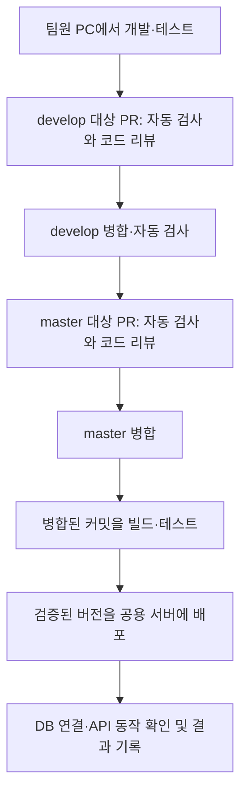

# 공용 서버 배포 안내

## 1. 개발부터 배포까지의 흐름입니다

팀원은 개인 PC와 개인 개발 DB에서 작업하고 `develop`에 변경 사항을 모읍니다. `develop` 푸시와 `develop`·`master` 대상 PR에서 자동 검사를 실행합니다. 공용 Windows 서버에는 리뷰와 검사를 통과한 `master`의 API와 공용 MySQL을 실행합니다.



| 파일 | 역할 |
| --- | --- |
| `.github/workflows/ci.yml` | `develop` 푸시와 `develop`·`master` 대상 PR을 검사하고 배포 워크플로에도 같은 검사를 제공합니다. |
| `.github/workflows/release.yml` | `master`에 반영된 커밋을 검사한 뒤 이미지를 게시하고 공용 서버에 배포합니다. |
| `server/Dockerfile` | CI에서 검증한 `app.jar`로 실행 이미지를 만듭니다. 서버에서 다시 컴파일하지 않습니다. |
| `server/deploy/compose.yaml` | 공용 MySQL과 API, 재시작 정책, 별도 데이터 볼륨을 정의합니다. |
| `server/deploy/deploy.ps1` | 설정 검사, 이미지 다운로드, DB 백업, API 교체, 상태 검사와 성공 기록을 수행합니다. |
| `server/deploy/.env.example` | 서버에만 보관할 설정 파일의 항목을 제공합니다. |

PR의 `client` 검사는 `npm ci`, TypeScript 검사, Android·iOS·웹 Expo 번들 생성을 수행합니다. `server` 검사는 Maven Wrapper의 `clean verify`, 독립된 MySQL 8.4에서의 JAR 실행과 DB 연결 상태 검사를 수행합니다. 현재 업무 API·엔티티·테이블과 업무 기능 테스트는 없으므로 readiness 성공을 업무 기능 전체의 검증으로 해석하지 않습니다. SQL 마이그레이션을 추가하면 CI의 새 시험 DB에 적용됩니다. 기존 공용 데이터의 모든 형태에 대한 이관 시험까지 대신하지는 않습니다.

`master` 병합 후에는 `checks → publish → deploy` 순서로 실행합니다. `checks`가 보관한 `server-jar` 아티팩트의 동일 JAR를 이미지에 넣습니다. 이미지는 `ghcr.io/whitetiger0804/mobtwig-server:<커밋 SHA>` 태그로 게시하며, 서버에는 변경 불가능한 `@sha256:...` 다이제스트 주소를 전달합니다. GitHub 작업은 한 번에 하나씩 배포하며 진행 중인 작업을 새 배포가 취소하지 않습니다. 배포 직전 해당 커밋이 현재 `master`인지도 확인합니다.

현재 저장소에는 이 실행 절차를 정의한 파일이 있습니다. Windows 서버 설치, GitHub Variables·Secrets, 브랜치 보호, Tailscale 정책을 실제 계정과 장치에 등록하는 작업은 별도 최초 설정입니다. 이를 완료하기 전에 `master`로 병합하면 배포 단계가 실패합니다. 설정 누락을 성공으로 건너뛰지 않습니다.

## 2. Windows 서버의 실행 환경을 준비합니다

지원되는 Windows 10·11에서 Docker Desktop의 Linux 컨테이너 엔진과 WSL 2, Tailscale, OpenSSH Server를 준비합니다. 운영체제 빌드와 가상화 조건은 [Docker Windows 설치 안내](https://docs.docker.com/desktop/setup/install/windows-install/)에서 확인합니다. 실행할 Java는 이미지에 포함되므로 서버 PC에 JDK나 Maven을 따로 설치할 필요는 없습니다.

배포에 사용할 전용 Windows 로컬 계정을 정합니다. 이 계정이 Docker Desktop을 실행하고 `docker version`으로 엔진에 접근하며 `C:\Mobtwig`에 파일을 쓸 수 있어야 합니다. Docker 접근 권한은 컨테이너와 호스트 파일에 영향을 줄 수 있으므로 일반 팀원 계정과 구분합니다. `docker-users` 그룹이 필요한 설치 방식에서는 관리자 계정으로 해당 그룹에 배포 계정을 추가하고 다시 로그인합니다.

서버의 배포 계정으로 로그인하여 다음을 확인합니다.

```powershell
chcp 65001 > $null
docker version
docker compose version
tailscale status
```

Docker Desktop의 로그인 시 자동 시작을 켜고 Tailscale의 무인 실행을 설정합니다. Compose의 `restart: unless-stopped`는 Docker 엔진이 실행된 상태에서 컨테이너 복구를 담당합니다. Docker Desktop은 사용자 로그인에 의존하므로 이 설정만으로 재부팅 후 로그인 전까지 API가 복구되는 것은 아닙니다. 서버에 다시 로그인한 뒤 엔진과 서비스가 복구되는지 직접 확인합니다. 로그인 없는 부팅 복구가 필요하면 별도 Windows 서비스 또는 자동 부팅 Linux VM 구성을 설계해야 합니다. [Docker Desktop 설정](https://docs.docker.com/desktop/settings-and-maintenance/settings/), [Tailscale 무인 실행](https://tailscale.com/docs/how-to/run-unattended)

Windows OpenSSH가 없다면 관리자 PowerShell에서 설치하고 서비스를 자동 시작합니다. 이미 설치되었다면 설치 명령은 반복하지 않습니다.

```powershell
chcp 65001 > $null
Get-WindowsCapability -Online -Name OpenSSH.Server~~~~0.0.1.0
Add-WindowsCapability -Online -Name OpenSSH.Server~~~~0.0.1.0
Start-Service sshd
Set-Service -Name sshd -StartupType Automatic
```

Windows 방화벽에서는 Tailscale을 통한 SSH TCP `22` 접근을 허용합니다. 공유기의 공인 인터넷 포트 포워딩은 필요하지 않습니다. Windows에서는 일반 OpenSSH를 Tailscale 네트워크 위에서 사용합니다. 설치 및 계정별 키 경로는 [Microsoft OpenSSH 안내](https://learn.microsoft.com/en-us/windows-server/administration/openssh/openssh-server-configuration)를 따릅니다.

## 3. 서버 설정과 최초 공용 DB를 준비합니다

서버의 저장 경로는 다음과 같습니다.

```text
C:\Mobtwig\
├─ config\
│  ├─ .env                   # 서버 비밀번호와 포트 설정입니다.
│  └─ compose.yaml           # 최초 MySQL 실행에 사용하는 사본입니다.
├─ releases\<커밋 SHA>\      # 해당 커밋의 Compose와 배포 스크립트입니다.
├─ state\                   # 배포 잠금과 last-success.json입니다.
└─ backups\                 # 배포 전 SQL 백업입니다.
```

DB의 실제 데이터는 Docker 볼륨 `mobtwig-shared_mysql_data`에 보관됩니다. 저장소의 `server/db`나 `C:\Mobtwig\releases`에 데이터 파일을 저장하지 않습니다. 로컬 개발용 볼륨 `mobtwig-local84_mysql_data`와도 구분합니다.

최초 설정 파일을 가져오기 위해 서버에 저장소를 클론해도 됩니다. 아래 명령은 서버에서 저장소 루트에 위치한 상태로, 설정 파일이 아직 없는 최초 한 번 실행합니다. 이후 자동 배포는 필요한 두 파일을 SCP로 전달하므로 서버의 저장소에서 `git pull`을 실행하지 않습니다. 클론 대신 동일 파일을 직접 전달할 수도 있습니다.

```powershell
chcp 65001 > $null
New-Item -ItemType Directory -Force -Path C:\Mobtwig\config, C:\Mobtwig\releases, C:\Mobtwig\state, C:\Mobtwig\backups
Copy-Item -LiteralPath server/deploy/.env.example -Destination C:\Mobtwig\config\.env
Copy-Item -LiteralPath server/deploy/compose.yaml -Destination C:\Mobtwig\config\compose.yaml
notepad C:\Mobtwig\config\.env
```

`DB_PASSWORD`와 `DB_ROOT_PASSWORD`에 서로 다른 충분히 긴 영문 대소문자·숫자 비밀번호를 입력합니다. 나머지 기본값은 공용 DB `mobtwig_shared`, 앱 계정 `mobtwig_app`, 호스트 DB 포트 `3307`, API 포트 `8080`입니다. 호스트 포트를 변경하면 이 문서의 Tailscale Serve·접속 확인 명령도 같은 포트로 맞춥니다. 이 파일은 GitHub에 올리거나 팀원의 앱 설정에 복사하지 않습니다. 설정·백업 폴더의 Windows 파일 권한도 배포 계정과 필요한 관리자만 읽고 쓸 수 있도록 제한합니다.

먼저 MySQL만 기동합니다. Compose는 사용하지 않는 API 서비스의 변수도 해석하므로 `API_IMAGE` 값을 임시로 지정합니다. 아래 값은 현재 체크아웃의 커밋 태그 형식을 사용하지만 이 단계에서는 `mysql`만 시작하여 API 이미지를 내려받거나 실행하지 않습니다. 실제 배포에서는 워크플로가 검증된 이미지의 다이제스트를 주입합니다.

```powershell
chcp 65001 > $null
$initialCommit = git rev-parse HEAD
$env:API_IMAGE = "ghcr.io/whitetiger0804/mobtwig-server:$initialCommit"
docker compose --project-name mobtwig-shared --env-file C:\Mobtwig\config\.env --file C:\Mobtwig\config\compose.yaml config --quiet
docker compose --project-name mobtwig-shared --env-file C:\Mobtwig\config\.env --file C:\Mobtwig\config\compose.yaml up -d --wait --wait-timeout 180 mysql
docker compose --project-name mobtwig-shared --env-file C:\Mobtwig\config\.env --file C:\Mobtwig\config\compose.yaml ps
Remove-Item Env:\API_IMAGE
```

`mysql`이 `healthy`인지 확인합니다. 최초 빈 볼륨에서는 DB와 앱 계정이 생성됩니다. 기존 볼륨에서는 `.env`의 비밀번호만 바꾸어도 DB 계정 비밀번호가 자동 변경되지 않습니다. MySQL 8.0의 기존 볼륨을 이 설정에 연결하지 않습니다. 기존 자료 이관은 백업과 시험 복원을 별도로 검증한 뒤 수행합니다.

## 4. 서버의 이미지 다운로드 권한을 준비합니다

GitHub Actions는 자체 `GITHUB_TOKEN`으로 GHCR에 이미지를 게시합니다. 서버가 비공개 이미지를 받으려면 그 패키지에 읽기 권한이 있는 GitHub 계정과 `read:packages` 권한의 PAT classic이 필요합니다. 이 토큰은 서버의 배포 계정으로 Docker 로그인에 사용합니다. [GitHub Container registry 인증](https://docs.github.com/en/packages/working-with-a-github-packages-registry/working-with-the-container-registry)

서버의 배포 계정 PowerShell에서 토큰을 화면·명령 기록에 직접 입력하지 않고 다음 프롬프트로 전달합니다.

```powershell
chcp 65001 > $null
$registryUser = Read-Host '이미지 읽기 권한이 있는 GitHub 계정명을 입력하십시오'
$registryToken = Read-Host 'read:packages 권한의 PAT classic을 입력하십시오' -AsSecureString
([System.Net.NetworkCredential]::new('', $registryToken)).Password | docker login ghcr.io --username $registryUser --password-stdin
Remove-Variable registryToken
```

로그인이 성공해야 합니다. Windows의 Docker 자격 증명 저장소도 같은 배포 계정 기준이므로, 다른 관리자 계정에서 로그인한 결과를 그대로 사용할 수 있다고 가정하지 않습니다. 첫 이미지가 게시된 뒤 SSH로 로그인한 동일 계정에서도 그 이미지의 `docker pull`이 성공하는지 확인합니다. PAT 만료·권한 변경 때에는 이 계정의 로그인을 갱신합니다.

## 5. Tailscale의 배포 경로를 설정합니다

서버 장치에 `tag:mobtwig-server` 태그를 부여하고 배포용 `tag:mobtwig-deploy` 태그를 정의합니다. 태그를 부여할 수 있는 관리자도 정책의 `tagOwners`에 지정합니다. 배포 노드는 서버 TCP `22`에만 접근하도록 다음 grant를 기존 정책에 통합합니다. 기존 전체 허용 규칙이 남아 있으면 이 규칙이 접근을 제한하지 못하므로 기존 정책까지 함께 확인합니다.

```json
{
  "src": ["tag:mobtwig-deploy"],
  "dst": ["tag:mobtwig-server"],
  "ip": ["tcp:22"]
}
```

Tailscale의 Trust credentials에서 GitHub Actions용 OpenID Connect 자격 증명을 생성합니다. 발급자 `https://token.actions.githubusercontent.com`, 현재 저장소, `refs/heads/master`만 신뢰하도록 범위를 제한합니다. 기본 subject 형식의 예시는 `repo:whitetiger0804/Mobtwig:ref:refs/heads/master`입니다. 계정·조직의 OIDC subject 설정과 발급 형식이 다르면 실제 형식으로 맞춥니다. 넓은 와일드카드로 모든 PR이나 저장소를 허용하지 않습니다. 추가 claim 규칙으로 `repository`, `ref`, `workflow_ref`도 현재 저장소의 배포 워크플로로 제한할 수 있습니다.

자격 증명에는 `auth_keys` 쓰기 권한과 `tag:mobtwig-deploy`를 지정합니다. 생성된 Client ID와 Audience를 아래 GitHub Variables에 등록합니다. 이 구성은 단기 OIDC 토큰을 사용하며 Tailscale의 장기 OAuth 비밀키나 인증키를 GitHub에 저장하지 않습니다. [Tailscale OIDC 설정](https://tailscale.com/docs/features/workload-identity-federation), [GitHub Action 요구 권한](https://github.com/tailscale/github-action)

팀원의 DB·API 접속은 배포 경로와 별도로 허용합니다. 실제 팀원 계정으로 구성한 그룹에서 서버 TCP `3307`과 `8080`에 접근하도록 grant를 설정합니다. 서버에서 다음 명령으로 로컬에만 바인딩된 DB와 API를 tailnet에 연결합니다.

```powershell
chcp 65001 > $null
tailscale serve --bg --tcp=3307 tcp://127.0.0.1:3307
tailscale serve --bg --tcp=8080 tcp://127.0.0.1:8080
tailscale serve status
tailscale ip -4
```

팀원은 자신의 Tailscale에 로그인한 뒤 서버의 Tailscale 주소로 접속합니다. MySQL 계정은 팀원별로 부여하고, 공용 스키마 변경은 배포의 Flyway 경로로 제한합니다. 공용 DB에 연결하는 팀원의 로컬 백엔드는 프로세스 환경변수 `SPRING_FLYWAY_ENABLED=false`를 설정하여 승인 전 마이그레이션이 실행되지 않도록 합니다. `.env` 예시의 앱 계정과 root 비밀번호를 팀원 공용 로그인으로 배포하지 않습니다. [Tailscale Serve TCP 옵션](https://tailscale.com/docs/reference/tailscale-cli/serve)

## 6. SSH 키와 GitHub 설정을 등록합니다

GitHub Actions 전용 Ed25519 키를 준비합니다. 개인 개발용 SSH 키를 재사용하지 않습니다. 자동 접속용 키는 입력 프롬프트 없이 사용할 수 있어야 하며, 개인키는 GitHub Actions Secret으로만 전달합니다. 서버의 배포 계정에는 대응하는 공개키를 등록합니다.

일반 로컬 계정의 기본 키 경로는 `C:\Users\<배포 계정>\.ssh\authorized_keys`입니다. 관리자 그룹 계정은 기본 OpenSSH 설정에서 `C:\ProgramData\ssh\administrators_authorized_keys`를 사용하므로 두 경로를 혼동하지 않습니다. 계정과 파일 권한은 [Windows OpenSSH 키 설정](https://learn.microsoft.com/en-us/windows-server/administration/openssh/openssh-server-configuration#authorizedkeysfile)에 맞춥니다.

서버의 SSH 호스트 공개키를 서버 자체에서 확인합니다. 아래 출력은 공개키와 지문이며 개인키 파일을 읽지 않습니다.

```powershell
chcp 65001 > $null
Get-Content -LiteralPath C:\ProgramData\ssh\ssh_host_ed25519_key.pub
ssh-keygen -lf C:\ProgramData\ssh\ssh_host_ed25519_key.pub
```

`DEPLOY_SSH_KNOWN_HOSTS`에는 `DEPLOY_HOST와 같은 주소 ssh-ed25519 공개키내용` 형식의 한 줄을 등록합니다. 주소·키·지문이 해당 서버의 값인지 직접 확인합니다. 워크플로는 `StrictHostKeyChecking=yes`를 사용하여 키가 달라지면 실패합니다. 키 변경은 서버 재설치 등 실제 변경 여부를 확인한 뒤 등록값을 갱신합니다.

GitHub 저장소의 Settings → Secrets and variables → Actions에 다음을 등록합니다.

| 구분 | 이름 | 값 |
| --- | --- | --- |
| Variable | `DEPLOY_HOST` | 서버의 Tailscale IPv4 주소 또는 DNS 이름입니다. SSH 기본 포트 `22`를 사용합니다. |
| Variable | `DEPLOY_USER` | Docker와 `C:\Mobtwig`에 접근할 수 있는 Windows 배포 계정명입니다. |
| Variable | `TS_CLIENT_ID` | Tailscale OIDC Client ID입니다. |
| Variable | `TS_AUDIENCE` | 같은 Tailscale OIDC 자격 증명의 Audience입니다. |
| Secret | `DEPLOY_SSH_PRIVATE_KEY` | 배포 전용 Ed25519 개인키의 전체 내용입니다. |
| Secret | `DEPLOY_SSH_KNOWN_HOSTS` | 직접 확인한 서버 주소와 SSH 호스트 공개키의 known_hosts 항목입니다. |

현재 워크플로는 한글을 포함한 문자·숫자·밑줄로 시작하고 이후 문자·숫자·밑줄·점·하이픈으로 구성한 로컬 `DEPLOY_USER`를 사용합니다. `나`와 같은 한글 계정명도 사용할 수 있습니다. `도메인\사용자` 형식이나 공백이 있는 이름은 지원하지 않습니다. 호스트에는 프로토콜 접두사나 포트 번호를 붙이지 않습니다.

GitHub에서 Actions 실행과 GHCR 패키지 쓰기가 허용되어 있어야 합니다. `publish` 잡은 `packages: write`, `deploy` 잡은 OIDC 발급을 위한 `id-token: write` 권한을 사용합니다. DB 비밀번호는 GitHub Variables나 앱의 `EXPO_PUBLIC_` 변수에 등록하지 않습니다.

`master`의 브랜치 보호 또는 Ruleset에는 PR 경유, 리뷰 승인 1개, 필수 검사 `client`와 `server`를 등록합니다. 처음 PR을 실행한 뒤 GitHub가 표시하는 실제 체크 이름을 선택합니다. 승인과 필수 검사는 YAML만으로 강제되지 않으므로 저장소 설정에서 별도로 적용합니다. 현재 원격 저장소에 이 설정을 자동 등록하는 코드는 포함하지 않습니다.

## 7. 최초 배포와 이후 업데이트를 확인합니다

서버 준비와 GitHub 설정을 완료한 뒤 PR을 생성합니다. CI가 통과하고 리뷰 승인을 받으면 `master`에 병합합니다. Actions의 `공용 서버에 배포합니다` 작업에서 `checks`, `publish`, `deploy`의 순서와 결과를 확인합니다. 현재 `master`에 대해 수동 `Run workflow`로도 실행할 수 있습니다.

배포 작업은 다음 순서로 동작합니다.

1. CI를 다시 실행하고 통과한 동일 JAR로 이미지를 게시합니다.
2. 필수 설정과 최신 `master` 커밋을 확인한 뒤 Tailscale에 단기 배포 노드를 연결합니다.
3. `C:\Mobtwig\releases\<커밋 SHA>`에 해당 커밋의 `compose.yaml`과 `deploy.ps1`을 전달합니다.
4. 서버에서 배포 파일 잠금을 획득하고 설정을 검사합니다. API 이미지를 받은 뒤 공용 DB의 `healthy` 상태를 확인합니다.
5. 기존 API를 중지하고 SQL 백업을 `C:\Mobtwig\backups`에 보관합니다.
6. MySQL 컨테이너는 유지하면서 API만 교체합니다. 새 API 시작 시 Flyway가 적용됩니다.
7. DB 연결이 포함된 API readiness를 검사합니다. 성공 시 커밋, 이미지 다이제스트, 백업 경로, 시각을 `state\last-success.json`에 기록합니다. GitHub 작업 요약에는 커밋, 이미지와 검사 성공을 기록합니다.

API 중지부터 새 API의 준비 완료까지 짧은 서비스 중단이 있습니다. 공용 DB에 직접 접근하는 팀원의 쓰기 작업은 API 중지로 차단되지 않으므로 배포·구조 변경 시간에는 해당 작업도 중지하도록 협의합니다. 이미지 다운로드·백업·마이그레이션·상태 확인 중 실패하면 배포도 실패합니다.

서버에서 가장 최근 성공 기록을 확인할 수 있습니다.

```powershell
chcp 65001 > $null
Get-Content -LiteralPath C:\Mobtwig\state\last-success.json
Invoke-RestMethod http://127.0.0.1:8080/actuator/health/readiness
```

GitHub의 성공 결과만으로 재부팅 후 자동 복구까지 확인된 것은 아닙니다. 서버 재부팅과 배포 계정 로그인 후 Docker Desktop, Tailscale, MySQL, API와 외부 팀원 접속을 별도로 확인합니다.

## 8. 실패 대응과 데이터 보존을 처리합니다

배포 실패 시 API가 중지되어 있을 수 있습니다. `last-success.json`은 새 배포의 readiness가 성공한 경우에만 갱신하므로 실패하면 직전 성공 기록을 유지합니다. GitHub 실패 로그, 해당 배포 Compose의 `ps`·`logs`, DB 상태와 백업을 먼저 확인합니다. DB 마이그레이션을 자동 취소하거나 백업을 자동 덮어쓰기 복원하지 않습니다.

새 배포가 실패했고 직전 앱과 현재 DB 구조가 호환되는 것을 확인했다면 다음 명령으로 마지막 성공 이미지의 API만 복귀시킬 수 있습니다. 최초 배포부터 실패하여 성공 기록이 없는 경우에는 이 명령을 사용하지 않습니다.

```powershell
chcp 65001 > $null
$lastSuccess = Get-Content -LiteralPath C:\Mobtwig\state\last-success.json -Raw | ConvertFrom-Json
$env:API_IMAGE = $lastSuccess.ImageReference
$lastCompose = "C:\Mobtwig\releases\$($lastSuccess.CommitSha)\compose.yaml"
docker compose --project-name mobtwig-shared --env-file C:\Mobtwig\config\.env --file $lastCompose pull api
docker compose --project-name mobtwig-shared --env-file C:\Mobtwig\config\.env --file $lastCompose up -d --no-deps --wait --wait-timeout 180 api
Invoke-RestMethod http://127.0.0.1:8080/actuator/health/readiness
Remove-Item Env:\API_IMAGE
```

배포는 성공했지만 이후 업무 오류로 이전 버전이 필요한 경우에는 마지막 성공 기록의 `PreviousImageReference`와 해당 이전 커밋의 배포 기록을 확인하여 복귀 대상을 결정합니다. 위 명령은 마지막 성공 버전을 실행하므로 이런 경우 그대로 사용하면 현재 버전을 다시 실행합니다.

이전 앱을 실행해도 삭제된 컬럼·데이터는 돌아오지 않습니다. SQL 변경은 추가·이관·앱 전환·이전 구조 제거를 나누고, 적용된 마이그레이션 파일은 수정하지 않습니다. 실제 DB 복원은 별도 DB에서 백업 복원을 시험한 뒤 복구 시점과 이후 데이터 손실 여부를 판단하여 수행합니다.

`mobtwig-shared_mysql_data`에 대해 `docker compose down --volumes`, `down -v`, `docker volume rm`을 일반 배포·종료 명령으로 사용하지 않습니다. 배포 스크립트도 데이터 볼륨을 삭제하지 않습니다. 배포 전 백업은 같은 서버 디스크에 있으므로 서버 디스크 장애에 대비한 외부 사본과 정기 복원 시험이 별도로 필요합니다. 현재 배포 파일에는 정기 백업 스케줄이나 오래된 이미지·백업의 자동 삭제를 추가하지 않았습니다.
